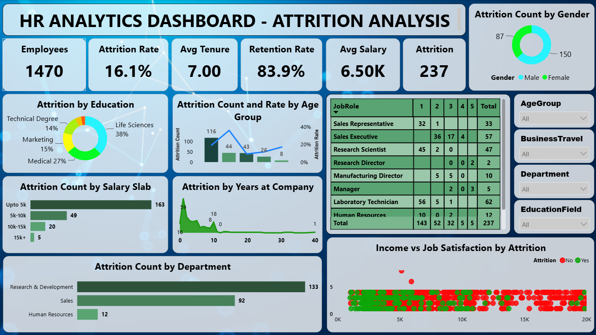

# 📊 HR Analytics Dashboard — Attrition Analysis

An interactive **Power BI dashboard** built as part of the **SyntecxHub Data Analysis Internship Program**.

---

## 📌 Project Overview

This project analyzes an HR employee dataset to understand patterns behind employee attrition. The dashboard helps HR teams identify which factors are most strongly linked to employees leaving, compare attrition across departments and roles, and track key workforce health metrics like Attrition Rate and Retention Rate.

---

## 📁 Dataset

**File:** `HR_Analytics.csv`

The dataset contains employee-level records including age, department, job role, salary, job satisfaction, years at company, business travel frequency, education, marital status, and attrition status (whether the employee left the company).

---

## 🎯 Objectives (as per project brief)

- Analyze employee dataset (salary, department, experience)
- Identify patterns in employee attrition
- Perform correlation analysis to find key factors
- Compare attrition across departments and roles
- Build KPIs like attrition rate, retention rate
- Create an HR dashboard for decision-making

---

## 🛠️ Tools Used

- **Power BI Desktop** — data modeling, DAX measures, visualization
- **Power Query (M)** — data cleaning and transformation
- **DAX** — custom measures (Attrition Rate, Retention Rate)

---

## 🧹 Data Cleaning (Power Query)

| Step | Description |
|---|---|
| **Changed Type** | Set correct data types for all columns |
| **RemovedDuplicates** | Applied `Table.Distinct()` to remove duplicate employee records |
| **CleanedNulls** | Replaced null values in `YearsWithCurrManager` column with `0` |

---

## 📈 Dashboard Features

- **KPI Cards:** Employees (distinct count), Attrition Rate, Avg Salary, Avg Tenure, Retention Rate, Attrition Count
- **Attrition Count by Gender** — donut chart
- **Attrition by Education** — donut chart
- **Attrition Count and Rate by Age Group** — combo chart
- **JobRole breakdown by JobLevel** — matrix table
- **Attrition Count by Salary Slab** — bar chart
- **Attrition by Years at Company** — area chart
- **Attrition Count by Department** — bar chart
- **Income vs Job Satisfaction by Attrition** — scatter chart (correlation analysis, one point per employee, colored by attrition status)
- **Slicers:** Age Group, Business Travel, Department, Education Field — filters the entire dashboard interactively

---

## 📐 Key DAX Measures

```dax
Attrition Rate = DIVIDE(SUM(HR_Analytics[AttritionCount]), DISTINCTCOUNT(HR_Analytics[EmpID]))
```

```dax
Retention Rate = FORMAT(1 - [AttritionRate], "0.0%")
```

---

## 🖼️ Dashboard Preview



---

## 📂 Files in this Repository

| File | Description |
|---|---|
| `HR_Analytics_Dashboard.pbix` | Power BI dashboard file |
| `HR_Analytics.csv` | Raw dataset used for analysis |
| `Dashboard.png` | Dashboard preview image |
| `README.md` | Project documentation |

---

## 🔍 Key Insights

- Employees in the 18–25 age group show the highest attrition count, with attrition rate declining in older age brackets
- Sales Executive and Laboratory Technician roles show the highest number of attritions among job roles
- Research & Development is the department with the highest attrition count, followed by Sales
- Lower salary slabs (Upto 5K) correlate with significantly higher attrition
- The scatter analysis of Income vs Job Satisfaction shows attrition (red/green points) spread across all satisfaction levels, suggesting income alone isn't the sole driver — multiple factors contribute to attrition

---

## 🙋 About

Built by **Satyam Kumar Singh** as part of the **SyntecxHub Internship Program** (Data Analysis Track).

🔗 Connect with me on [LinkedIn](https://www.linkedin.com/in/satyam-kumar-singhh)  
🌐 [SyntecxHub](https://www.syntecxhub.com)
